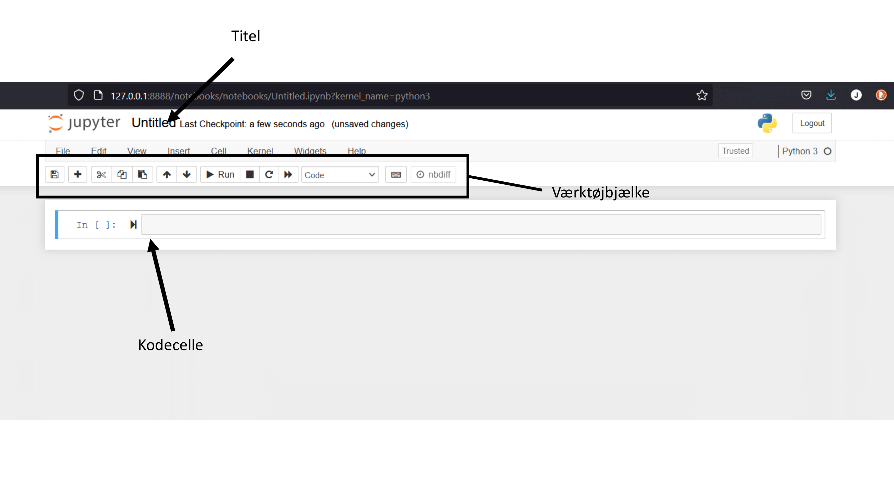
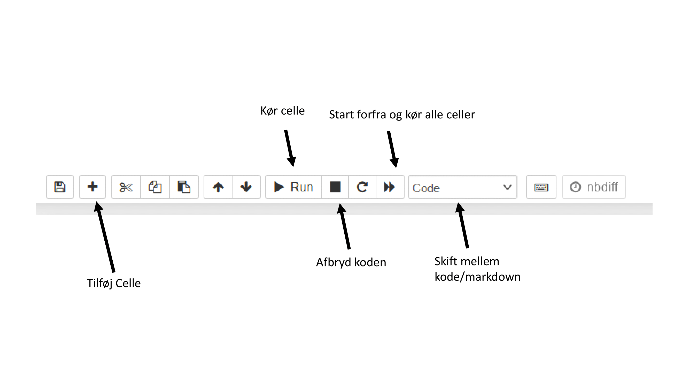

# Installation af Python
Før vi kan gå i gang med at bruge Python, må vi først få installeret. På fysik har vi besluttet at installere Anaconda implementationen, da denne kommer med stort set alle de pakker, som man skal bruge, når man starter op. Vi kan derfor kun nøjes med at foretage en installation. 

## Download Anaconda

Gå først ind på [https://www.anaconda.com/products/individual](https://www.anaconda.com/products/individual). Det bør gerne se således ud;

Scroll ned til bunden og tryk på den installation, der passer til dit system. 

Gem installeren og kør den. 

## Installation

Tryk _Next_ > _I agree_ > _Next_, vælg det sted du vil installere Anaconda (evt. bare den foreslået lokation), > Tryk ja i de to ticks, hvis du aldrig har arbejdet med Python før. _Install_ > _Next_ > _Next_ > Fjern de to ticks og tryk finish.

## Åbne Jupyter Notebook
Åben Anaconda Navigator, og kør den (vær ikke bange hvis der kommer en terminal op, det gør der også hos mig). Tryk på _launch_ under Jupyter Notebook, markeret med rød under

**OBS​:** Her kan du se den mappe, som min åbner. Jeg vil ikke gemme min kode her, og det vil du nok heller ikke. For at holde styr på sit arbejde, kan man med fordel gemme sin kode i forskellige mapper. Derfor skal man navigere derhen, hvor man gerne vil gemme sin kode. Det kunne være en mappe, der hedder `MekRel_Python_aflevering_1`.

Tryk så på _New_ (oppe til højre) > Python 3. 

Du har nu åbnet en Python notebook og kan nu skrive Python. Selv Notebooken har følgene layout:

De vigtigste knapper at kende på værktøjsbjælken kan findes her:

Nu er du klar til at programmere i Python.
