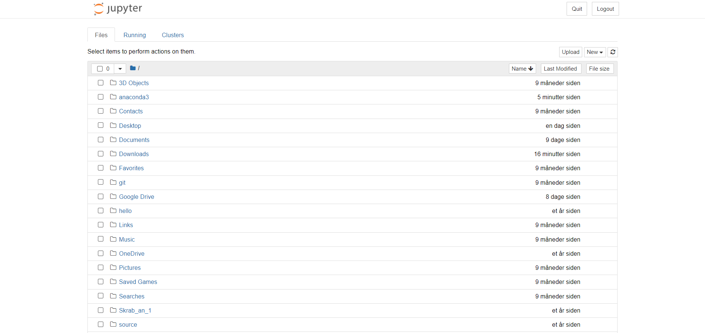

## Hvordan man downloader anaconda og der igennem åbner Jupyter

### Download Anaconda

Gå først ind på [https://www.anaconda.com/products/individual](https://www.anaconda.com/products/individual). Det bør gerne se således ud;

Scroll ned bunden og tryk på den installation der passer til dit system. 

Gem installeren og kør den. 

### Installation

Tryk Next > I agree > Next, vælg det sted du vil installere anaconda jeg anbefaler der hvor den foreslår > Tryk ja i de to ticks hvis du aldrig har arbejdet med python før > Install > Next > Next > Fjern de to ticks og tryk finish.

### Åbne Jupyter Notebook
Åben Anaconda Navigator og kør den (vær ikke bange hvis der kommer Comando Prompter op der gør der også hos mig). Tryk på launch under Jupyter Notebook, Markeret med rød under

**OBS​:** Her kan du se den mappe som min åbner. Jeg vil ikke gemme min kode her, og det vil du nok heller ikke. Man vil nok gemme sin kode forskellige steder. Derfor skal man navigere der hen hvor man gerne vil gemme sin kode fx. en mappe der hedder `MekRel_Python_aflevering_1`.

Tryk så på New(oppe til højre) > Python 3. 

Du har nu åbnet en python notebook og kan nu skrive Python. For at komme videre her fra skal du kigge i noten `Basal Python`.